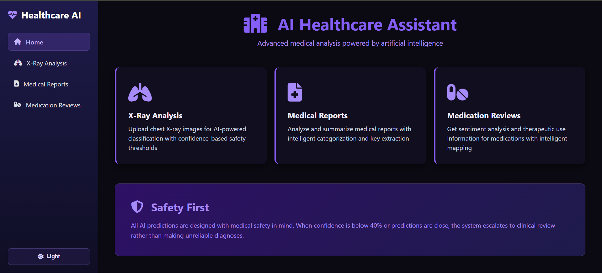
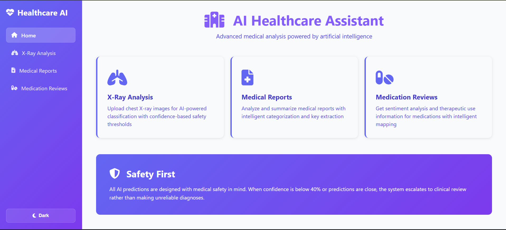
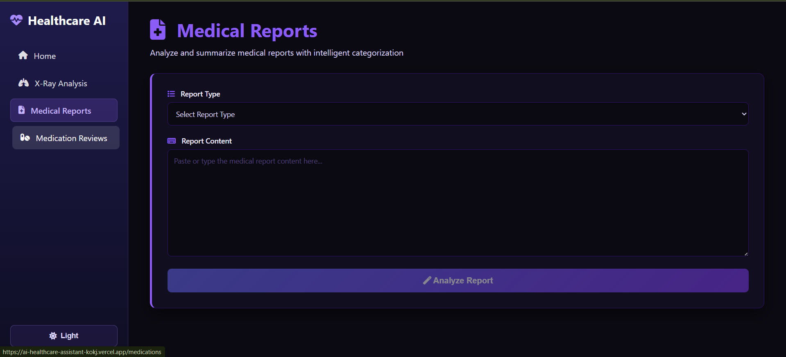
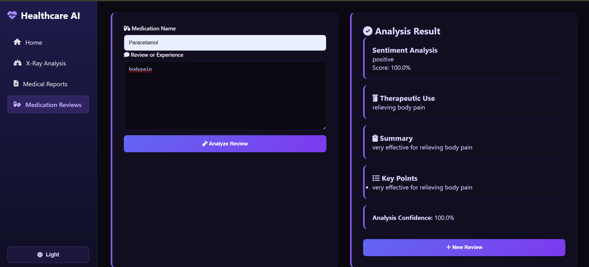
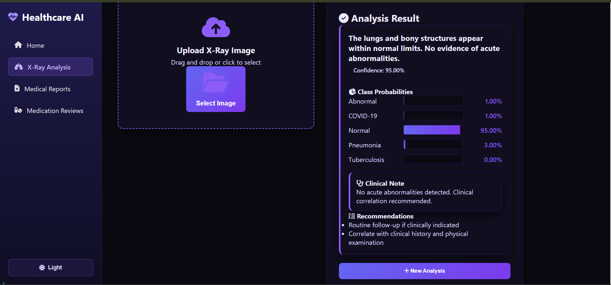

<div align="center">

#  AI Healthcare Assistant

### X-Ray Analysis • Medical NLP • Intelligent Healthcare System

<p>
A multi-module AI-powered healthcare assistant that combines computer vision and natural language processing to analyze medical data, assist diagnosis, and provide intelligent insights.
</p>

<br/>

<a href="YOUR_LIVE_LINK_HERE" target="_blank">
  
</a>

<br/><br/>


</div>

---

## Overview

**AI Healthcare Assistant** is an advanced AI-driven system that integrates multiple healthcare functionalities into a single platform.

It combines:
- **Computer Vision** for X-ray analysis  
- **Natural Language Processing (NLP)** for medical reports  
- **Sentiment & semantic analysis** for medication reviews  

The application is designed with a strong focus on **safety, interpretability, and usability**, making it a comprehensive healthcare intelligence tool.

---

## Screenshots & Modules

<div align="center">

| Dashboard | Dark Mode |
|-----------|-----------|
|  |  |

| Medical Reports | Medication Reviews |
|----------------|-------------------|
|  |  |

| X-Ray Analysis |
|---------------|
|  |

</div>

---

## Explanation of Features

### 1. Dashboard

- Central hub of the application  
- Provides access to all modules:
  - X-ray analysis  
  - Medical reports  
  - Medication reviews  
- Includes **dark/light mode toggle**  
- Designed for clean navigation and usability  

---

### 2. X-Ray Analysis (Computer Vision)

- Users upload chest X-ray images  
- Deep learning model analyzes the image  
- Outputs:
  - Predicted condition (Normal / Pneumonia / etc.)  
  - Confidence score  
  - Class probability distribution  
  - Clinical notes and recommendations  

This module uses **CNN-based image classification**.

---

### 3. Medical Reports (NLP)

- Users input medical report text  
- System processes and extracts key information  
- Outputs:
  - Categorized insights  
  - Structured summaries  
  - Important medical highlights  

This module uses **text processing and NLP techniques**.

---

### 4. Medication Reviews (NLP + Sentiment Analysis)

- Users input medication name and experience  
- System analyzes sentiment and extracts meaning  

Outputs include:
- Sentiment (positive/negative)  
- Confidence score  
- Therapeutic use  
- Summary  
- Key insights  

This helps understand real-world medication effectiveness.

---

### 5. Safety First Design

- If model confidence is low → avoids unreliable prediction  
- Encourages clinical review instead of blind automation  
- Designed to reduce risk in sensitive healthcare scenarios  

---

## Key Features

- Multi-module AI system (CV + NLP)  
- X-ray image classification  
- Medical text analysis and summarization  
- Sentiment analysis for medication reviews  
- Confidence-based safety mechanism  
- Modern responsive UI with dark mode  
- Structured and interpretable outputs  

---

## Technology Stack

<div align="center">

| Category | Technology |
|----------|-----------|
| Language |  Python |
| Deep Learning |  TensorFlow / CNN |
| NLP |  Text Processing |
| Backend |  Flask |
| Frontend |  HTML / CSS / JS |
| Visualization |  Charts & UI Components |

</div>

---

## Project Structure

```
ai_healthcare_assistant/
├── app.py
├── models/
│   ├── xray_model.h5
│   └── nlp_models.pkl
├── routes/
│   ├── xray.py
│   ├── reports.py
│   └── medication.py
├── templates/
├── static/
├── assets/
│   ├── home.png
│   ├── dark.png
│   ├── medical_reports.png
│   ├── medication.png
│   └── xray.png
├── requirements.txt
└── README.md
```

---

## How It Works

1. User selects module  
2. Inputs data (image/text)  
3. Backend processes input using ML/DL models  
4. Results are generated with confidence scores  
5. Output is displayed with structured insights  

---

## Use Cases

- AI-assisted medical analysis  
- Educational healthcare tools  
- Clinical decision support (non-diagnostic)  
- Research and experimentation  

---

## Future Improvements

- Real-time deployment with APIs  
- Integration with hospital systems  
- Larger datasets for improved accuracy  
- Explainable AI visualizations  
- Mobile application support  

---

## Disclaimer

This application is for educational and research purposes only.  
It does not replace professional medical advice, diagnosis, or treatment.

---

## License

This project is licensed under the MIT License.

---

<div align="center">

Developed by  
<strong>priyanildz</strong>

</div>